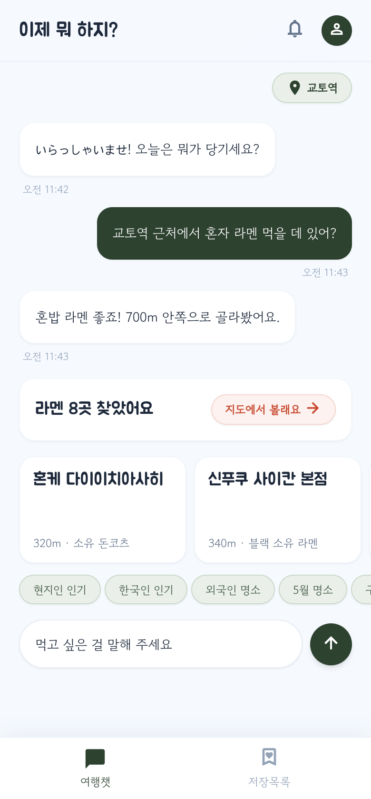
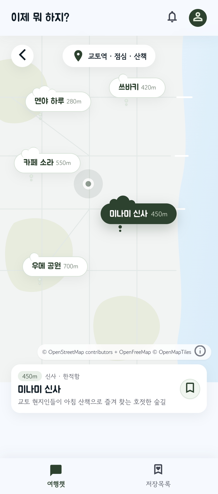
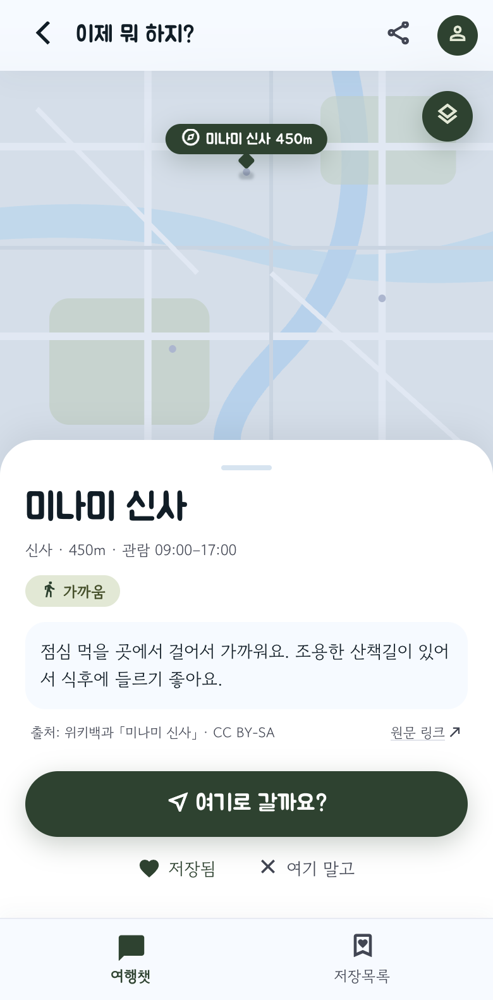
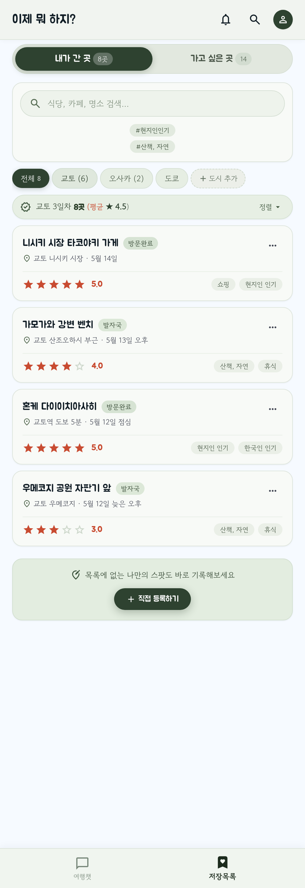
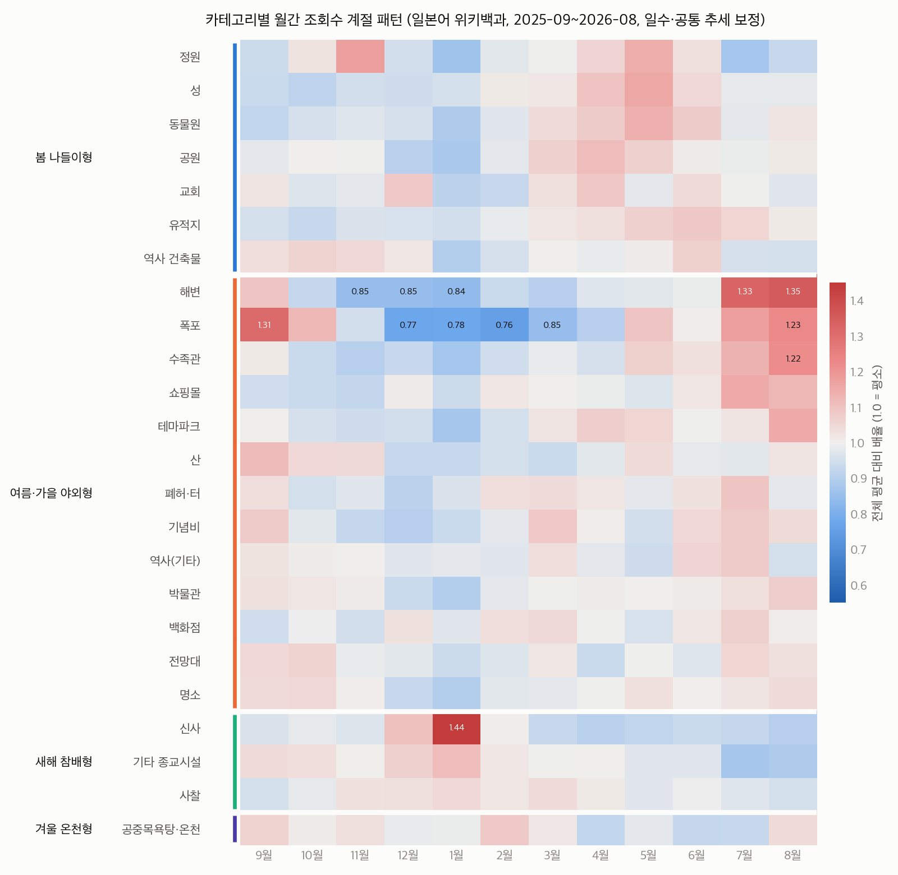

# 이제 뭐 하지? — 일본 여행 대화형 추천

> "교토역 근처에서 혼자 라멘 먹을 데 있어?" 한 문장으로, 지금 위치 주변에서 **갈 만한 곳 8곳**을 골라 주는 여행 동행 챗봇.
> 계획 없이 다니는 여행자(P)를 위한 서비스. 일본 전역 식당 18만 곳 + 관광지 20만 곳.

**서비스**: https://trip.seongjae.dev

| 여행챗 | 지도 | 장소 카드 | 저장목록 |
|---|---|---|---|
|  |  |  |  |

<sub>디자인 시안. 시안 요소 중 데이터로 뒷받침할 수 없는 것(맛 설명, 미슐랭·혼밥 태그 등)은 구현에서 뺐다 — `docs/web_design.md`</sub>

---

## 핵심 아이디어

**LLM 은 조건만 뽑고, 장소는 추천 시스템이 고른다.**

```
사용자 발화 ──▶ LLM 파서 (gpt-5-mini, JSON 스키마) ──▶ 조건 {종류, 테마, 반경, 제외, 브랜드 …}
                                                          │  + 프로필(자주 쓰는 조건, 취향)
                                                          ▼
                              후보 생성: 규칙 필터 (종류·방문지·거리·테마, 부족하면 반경 1→2→5→15km)
                                                          ▼
                              랭킹: (1−w)·인기도 + w·취향 − 거리,  w = 반응 수 / (반응 수 + 5)
                                                          ▼
                                      8곳 (마지막 1칸은 탐색용) ──▶ 고르기·넘기기로 취향 갱신
```

- LLM 이 장소 이름을 지어낼 수 없다 (답변은 조건을 받아 주는 한 문장뿐, 카드는 DB 에서)
- 칩(구경·산책·9월 명소 …)은 LLM 없이 바로 추천 → 비용 0
- 한 번 간 곳은 후보 생성·랭킹·세션 세 단계에서 빼서 **절대 다시 추천하지 않음**

## 데이터 파이프라인

| 단계 | 방법 | 결과 |
|---|---|---|
| 수집 | OpenStreetMap (Geofabrik 지역 파일 8개, pyosmium) | 음식점 20만, 관광지·쇼핑·휴식 37만, 역 9천 |
| 인기도·테마 | Wikidata 연결 + 위키백과 월별 조회수 (일·한·영) | 유명도(로그 스케일), **현지인 인기 / 한국인 인기 / 숨은 명소 / 이달 명소** 지수 |
| 음식 종류 ① | 이름 키워드 규칙 + 체인 목록(brand:wikidata 340개) | 88,494곳 (46%) |
| 음식 종류 ② | LLM few-shot 분류 (gpt-5-nano, Batch API, 약 $3) | 103,648곳 |
| 음식 종류 ③ | **Foursquare OS Places** (Apache 2.0) 와 같은 가게 매칭 (100m + 이름) | 72% 매칭, 세부 카테고리 79종, 폐업 12,147곳 제외 |
| 음식 종류 ④ | Foursquare 이름으로 학습한 **다중 라벨 BERT** (일본어 BERT-base) | 남은 미분류 중 확신도 0.8 이상만 |
| 한글 표기 | pykakasi 읽기 + 가나→한글 표기 규칙 (고유명사는 소리대로, 일반 단어는 번역) | 34만 곳 (`本家 第一旭` → 혼케 다이이치아사히) |

규칙 목록은 코드가 아니라 `rules/*.json` 으로 관리하고, 사람이(또는 LLM 이) 정한 라벨은 출처를 함께 기록했다. 전 과정은 스크립트로 다시 만들 수 있다 — `docs/pipeline.md`, `scripts/labeling/README.md`.


<sub>관광지 종류별 월간 조회수 패턴 — 이 신호로 "9월 명소" 테마를 만든다</sub>

## 검증과 결과

모든 숫자는 스크립트로 다시 계산된다 (`python3 pipeline.py run evaluate`, 결과 `data/reports/`).

**라벨 품질** (`scripts/eval/label_quality.py`, 일치율은 상위 26코드 기준. 카페↔디저트, 이자카야↔바처럼 겹치는 종류도 불일치로 셈)
| 출처 | Foursquare 와 일치 | 비고 |
|---|---|---|
| 이름 규칙 | 87.1% (61,309곳) | 샘플 검증 10/10 |
| LLM | 70.0% (31,269곳) | 샘플 검증 25/40 → LLM 과 Foursquare 가 다르면 Foursquare 를 따름 (9,390곳 교체) |
| BERT (확률 ≥ 0.8) | 93.3% (겹치는 카테고리 인정 시 94.8%) | 테스트 72,904곳 중 22% 에 적용. 1순위 정확도 50.5% — 이름에 음식 단어가 있으면 79.5%, 없으면 31.2% (`scripts/ml/eval_bert.py`) |

미분류(unknown): 47,471 → **22,122곳 (전체의 11.5%)**. 남은 곳은 종류를 정하지 않은 요청에서만 후보가 된다.

**추천 (가상 사용자 시뮬레이션, `scripts/eval/sim_rec.py`)**
- 숨은 취향을 가진 가상 사용자 300명 × 하루 7턴 (목록 8개): 성공률 우리 63.2% / 학습 없음 62.8% / 거리순 61.5% / 무작위 60.7%
- 3일(21턴): 학습 효과가 날마다 커져 3일째 58.8% vs 55.9% (+2.9%p)
- 목록 길이 5→8: 성공률 +3.8%p, 8→10 은 +1.9%p (실제 노출은 평균 5.1 → 6.2곳) → **8개로 결정**
- 시드 고정이라 다시 돌려도 결과가 바이트까지 같다

**해 보고 버린 것** (결과가 나빠 쓰지 않은 실험도 기록)
- 설명·리뷰 속성을 이름 임베딩 그래프로 전파: Wikivoyage 설명 1,219곳으로 검증, AUC 0.51~0.59 (거의 무작위) → 폐기 (`scripts/eval/propagation_check.py`)
- 파서 모델: gpt-5-nano 는 종류를 일본어로 뽑거나 "근처 신사"를 놓침 → gpt-5-mini
- 한국 블로그 크롤링: 네이버·브런치가 robots.txt 로 AI·RAG 이용을 금지 → 사용 안 함 (`docs/external_apis.md`)
- 식당 상세 정보(Hot Pepper): 약관(캐시·DB 복제 금지) 리스크로 수집한 데이터 전부 파기

## 성능

| 개선 | 전 → 후 |
|---|---|
| 공간 격자 인덱스 (전국 37만 곳 전체 스캔 제거) | 동시 50명 추천 p95 3.8초 → 0.49초 |
| 스레드풀 40 → 200 (LLM 대기가 스레드를 묶지 않게) | 동시 100명 처리량 88 → 183 요청/초 |
| DB 쿼리 합치기·연결 확인 왕복 제거 | 요청당 쿼리 22 → 9회 |
| 서버를 DB 와 같은 도쿄에 배치 | DB 왕복 42ms → 수 ms |

부하 테스트: 동시 200명 324 요청/초, 오류 0 (`server/tools/loadtest.py`, LLM 목업)

## 개인정보 설계

- **GPS 정확 좌표는 저장하지 않음**: geohash 6자리(약 1km)만. 일본 밖 GPS(한국에서 미리 계획)는 쓰지 않고 공항·역 목록에서 시작 위치를 고르게 함
- **개인 데이터와 행동 로그 분리**: 행동 로그는 무작위 `actor` id 로만 묶여, 탈퇴하면 사람과의 연결이 끊긴 익명 로그로 남음 (발화 원문 삭제, 위치 20km 단위로)
- 이메일·이름 받지 않음 (Google 은 `openid` 만), IP 대신 국가 두 글자만 기록
- DB 는 Data API 를 끄고 모든 테이블 RLS, 서버만 접근. 게스트 기록은 30일 뒤 DB 가 스스로 정리 (pg_cron)

## 로그 (추천 학습 데이터)

대화 한 번 = `turn_logs` 한 줄 (조건·보여준 8곳과 점수 분해·답변·LLM 토큰), 반응 한 번 = `reaction_logs` 한 줄 (몇 위를 열고·고르고·넘겼나).
뷰 `v_candidate_outcomes` 가 "노출 1건 = 1행 + 선택 여부" 학습 데이터를 바로 만든다. 로컬 증분 내보내기는 중단·재실행·동시 실행에도 중복·누락이 없게 설계 (`scripts/db/export_logs.py`, `docs/db_schema.md`).

## 아키텍처·기술

```
브라우저 ── trip.seongjae.dev (Cloudflare DNS)
   └─ Cloud Run: wsid-web (nginx, 화면 + /api 전달)  ──▶  Cloud Run: wsid-api (FastAPI, 장소 37만 곳 메모리)  ──▶  Supabase Postgres (도쿄)
                                                                  └─ OpenAI (파서)
```
- **백엔드**: Python, FastAPI, psycopg (커넥션 풀), 요청 기반 결제 Cloud Run (도쿄) — `docs/deploy_cloudrun.md`
- **데이터·ML**: pyosmium, DuckDB (Foursquare 1,100만 곳 중 일본만 원격 추출), transformers (tohoku BERT), OpenAI Batch API, Wikidata SPARQL
- **프론트**: 빌드 없는 바닐라 JS + Tailwind, MapLibre GL + OpenFreeMap (디자인 시안 색으로 지도 레이어를 다시 칠함)
- **DB**: Supabase Postgres 17, 마이그레이션 `supabase/migrations/`

## 폴더

| 경로 | 내용 |
|---|---|
| `src/japan_rec/` | 추천 핵심: 후보 생성, 랭킹, 프로필, 카테고리 사전, 한글 표기, 아이템 DB 빌드 |
| `server/` | FastAPI 서버와 웹 화면 |
| `scripts/` | 수집·라벨링·학습·평가·DB 도구 |
| `rules/` | 규칙·사전 (JSON): 체인, 키워드, 카테고리 체계, 동의어, 공항 목록 |
| `prompts/` | LLM 분류 프롬프트·few-shot·라벨 결정 기록 |
| `supabase/migrations/` | DB 스키마 |
| `deploy/cloudrun/` | 컨테이너 2개 (web·api) 와 Cloud Build 설정 |
| `docs/` | 파이프라인·DB·배포·화면 설계 문서 |
| `pipeline.py` | 재현 파이프라인 (수집 → 전처리 → 평가 → 로컬 테스트) |

## 재현하기

수집부터 로컬 테스트까지 **`pipeline.py` 하나로** 다시 돌린다. 데이터(`data/`, 약 5GB)는 용량·라이선스 때문에 저장소에 없고, 이 파이프라인으로 다시 만든다.

```bash
pip install -r requirements.txt           # 파이프라인·학습·서버 전체
cp deploy/env.example .env                # 키 채우기 (Wikimedia 연락처, OpenAI, Hugging Face, Supabase)

python3 pipeline.py list                  # 27단계: collect → preprocess → items → evaluate → serve
python3 pipeline.py run all --allow network,long     # 없는 출력만 차례로 (수집은 API 한도 때문에 수 시간)
python3 pipeline.py verify --allow long   # 외부 호출 없는 단계를 전부 다시 돌리고, 이전 결과와 행 수·sha256 비교
python3 scripts/cli_chat.py --start 교토역 # 로컬에서 대화로 테스트 (서버 없이 실제 API 를 같은 프로세스에서 호출)
cd server && uvicorn app.main:app --port 8000
```

- 단계마다 출력의 행 수·크기·sha256 을 `data/_runs/manifest.json` 에 남긴다
- 외부 API(`network`), 과금(`paid`), 오래 걸림(`long`) 단계는 `--allow` 로 허용해야 돈다
- **LLM 분류 결과는 고정**(2026-09-24): 다시 돌리면 비용이 들고 답이 달라져서, 파이프라인은 이 단계를 `--allow paid` 없이는 건너뛴다
- 2026-09-25 검증: 외부 호출 없는 단계를 처음부터 다시 돌려(`verify --allow long`, 약 45분) 모두 성공. OSM 추출·규칙 라벨·Foursquare 매칭·BERT 데이터·라벨 적용·아이템 DB·시뮬레이션은 두 번 돌려도 **바이트까지 같음**
- BERT 학습만 GPU(MPS) 연산이 완전히 결정적이지 않아 다시 학습하면 수치가 조금 달라진다 (1순위 정확도 49.9% → 50.5%)
- 자세한 단계 설명: `docs/pipeline.md`, 라벨링: `scripts/labeling/README.md`

## 데이터 출처

© OpenStreetMap contributors (ODbL) · Foursquare Open Source Places (Apache 2.0) · Wikidata (CC0) · Wikipedia (CC BY-SA) · 지도 타일 OpenFreeMap © OpenMapTiles · IP Geolocation by DB-IP (CC BY 4.0)
